# StyledComponents

A modern Angular application demonstrating the use of styled components and best practices in Angular development.

## Technology Stack

- Angular 19.2.0
- TypeScript 5.7.2
- RxJS 7.8.0
- Karma & Jasmine for testing

## Prerequisites

Before you begin, ensure you have the following installed:
- Node.js (Latest LTS version recommended)
- npm (comes with Node.js)
- Angular CLI (`npm install -g @angular/cli`)

## Getting Started

1. Clone the repository:
```bash
git clone [repository-url]
cd styled-components
```

2. Install dependencies:
```bash
npm install
```

3. Start the development server:
```bash
ng serve
```

Navigate to `http://localhost:4200/`. The application will automatically reload if you change any of the source files.

## Project Structure

```
styled-components/
├── src/                    # Source files
├── public/                 # Public assets
├── .angular/              # Angular build files
├── node_modules/          # Dependencies
└── ...config files
```

## Style Token System

The application implements a comprehensive token-based design system that ensures consistent styling across components. The token system is built using CSS custom properties (variables) and is organized in a hierarchical structure.

### Token Implementation

The token system is implemented in two main parts:

1. **CSS Custom Properties** (`src/styles.scss`):
   - Defines the actual CSS variables in the `:root` selector
   - Organized into logical sections (colors, spacing, typography, etc.)
   - Uses semantic naming for better maintainability

2. **TypeScript Constants** (`src/constants/colors.ts`):
   - Provides type-safe access to CSS variables
   - Organized into a structured object for easy access
   - Used in components and services for consistent styling

### Token Relations

```mermaid
graph TD
    A[TOKENS] --> B[color]
    A --> C[spacing]
    A --> D[typography]
    A --> E[radius]

    B --> F[background]
    B --> G[text]

    F --> H[PRIMARY]
    F --> I[SECONDARY]
    F --> J[SUCCESS]
    F --> K[WARNING]
    F --> L[DANGER]
    F --> M[INFOMATION]

    G --> N[PRIMARY]
    G --> O[SECONDARY]
    G --> P[SUCCESS]
    G --> Q[WARNING]
    G --> R[DANGER]
    G --> S[INFOMATION]

    C --> T[XS]
    C --> U[SM]
    C --> V[MD]
    C --> W[LG]
    C --> X[XL]
    C --> Y[XXL]
    C --> Z[XXXL]

    D --> AA[size]
    D --> AB[weight]
    D --> AC[lineHeight]

    AA --> AD[XS]
    AA --> AE[SM]
    AA --> AF[BASE]
    AA --> AG[LG]
    AA --> AH[XL]
    AA --> AI[XXL]
    AA --> AJ[XXXL]
    AA --> AK[XXXXL]

    AB --> AL[NORMAL]
    AB --> AM[MEDIUM]
    AB --> AN[SEMIBOLD]
    AB --> AO[BOLD]

    AC --> AP[TIGHT]
    AC --> AQ[NORMAL]
    AC --> AR[RELAXED]

    E --> AS[SM]
    E --> AT[MD]
    E --> AU[LG]
    E --> AV[XL]
    E --> AW[XXL]
    E --> AX[FULL]

    style A fill:#f9f,stroke:#333,stroke-width:2px
    style B fill:#bbf,stroke:#333,stroke-width:2px
    style C fill:#bbf,stroke:#333,stroke-width:2px
    style D fill:#bbf,stroke:#333,stroke-width:2px
    style E fill:#bbf,stroke:#333,stroke-width:2px
```



### Token Categories

#### Color Tokens
Colors are organized in a semantic hierarchy:
- Base colors (raw color values)
- Semantic colors (purpose-based naming)
- Background colors
- Text colors

```typescript
TOKENS.color.background.PRIMARY    // Primary background color
TOKENS.color.background.SECONDARY  // Secondary background color
TOKENS.color.background.SUCCESS    // Success state color
TOKENS.color.background.WARNING    // Warning state color
TOKENS.color.background.DANGER     // Danger state color
TOKENS.color.background.INFOMATION // Information state color
```

#### Spacing Tokens
Consistent spacing values throughout the application:
```typescript
TOKENS.spacing.XS    // 4px
TOKENS.spacing.SM    // 8px
TOKENS.spacing.MD    // 16px
TOKENS.spacing.LG    // 24px
TOKENS.spacing.XL    // 32px
TOKENS.spacing.XXL   // 48px
TOKENS.spacing.XXXL  // 64px
```

#### Typography Tokens
Comprehensive typography system including:
- Font sizes
- Font weights
- Line heights

```typescript
// Font Sizes
TOKENS.typography.size.XS     // 12px
TOKENS.typography.size.SM     // 14px
TOKENS.typography.size.BASE   // 16px
TOKENS.typography.size.LG     // 18px
TOKENS.typography.size.XL     // 20px
TOKENS.typography.size.XXL    // 24px
TOKENS.typography.size.XXXL   // 30px
TOKENS.typography.size.XXXXL  // 36px

// Font Weights
TOKENS.typography.weight.NORMAL    // 400
TOKENS.typography.weight.MEDIUM    // 500
TOKENS.typography.weight.SEMIBOLD  // 600
TOKENS.typography.weight.BOLD      // 700

// Line Heights
TOKENS.typography.lineHeight.TIGHT    // 1.25
TOKENS.typography.lineHeight.NORMAL   // 1.5
TOKENS.typography.lineHeight.RELAXED  // 1.75
```

#### Border Radius Tokens
Consistent border radius values:
```typescript
TOKENS.radius.SM    // 2px
TOKENS.radius.MD    // 6px
TOKENS.radius.LG    // 8px
TOKENS.radius.XL    // 12px
TOKENS.radius.XXL   // 16px
TOKENS.radius.FULL  // 9999px
```

### Using Tokens in Components

The application provides two ways to use tokens:

1. **Direct Usage in Components**:
```typescript
@Component({
  selector: 'ax-box',
  template: '...'
})
export class AxBoxComponent {
  @Input() backgroundColor: string = TOKENS.color.background.PRIMARY;
  @Input() color: string = TOKENS.color.text.PRIMARY;
  @Input() padding: string = TOKENS.spacing.MD;
  @Input() fontSize: string = TOKENS.typography.size.BASE;
  @Input() fontWeight: string = TOKENS.typography.weight.NORMAL;
  @Input() borderRadius: string = TOKENS.radius.MD;
  @Input() lineHeight: string = TOKENS.typography.lineHeight.NORMAL;
}
```

2. **Using the Styles Service**:
The `StylesService` provides pre-configured style combinations for different variants:
```typescript
@Component({
  selector: 'ax-box',
  template: '...'
})
export class AxBoxComponent {
  @Input() variant: VariantType = 'primary';
  private stylesService = inject(StylesService);

  getStyles() {
    return this.stylesService.getVariantStyles(this.variant);
  }
}
```

### Benefits of the Token System

1. **Consistency**: Ensures consistent styling across the application
2. **Maintainability**: Centralized management of design values
3. **Type Safety**: TypeScript integration prevents errors
4. **Flexibility**: Easy to update values globally
5. **Reusability**: Pre-configured style combinations for common use cases

## Available Scripts

- `npm start` - Starts the development server
- `npm run build` - Builds the project for production
- `npm run test` - Runs unit tests
- `npm run e2e` - Runs end-to-end tests

## Development

### Code Scaffolding

Generate new components, services, and other Angular artifacts using the Angular CLI:

```bash
ng generate component component-name
ng generate service service-name
ng generate directive directive-name
```

For a complete list of available schematics, run:
```bash
ng generate --help
```

### Building

To build the project for production:
```bash
ng build
```

The build artifacts will be stored in the `dist/` directory.

### Testing

- Unit Tests: `ng test`
- End-to-End Tests: `ng e2e`

## Additional Resources

- [Angular Documentation](https://angular.dev)
- [Angular CLI Overview](https://angular.dev/tools/cli)
- [TypeScript Documentation](https://www.typescriptlang.org/docs/)
- [RxJS Documentation](https://rxjs.dev/)

## Contributing

1. Fork the repository
2. Create your feature branch (`git checkout -b feature/amazing-feature`)
3. Commit your changes (`git commit -m 'Add some amazing feature'`)
4. Push to the branch (`git push origin feature/amazing-feature`)
5. Open a Pull Request

## License

This project is licensed under the MIT License - see the LICENSE file for details.
